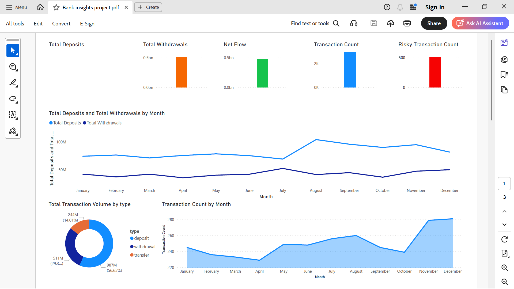
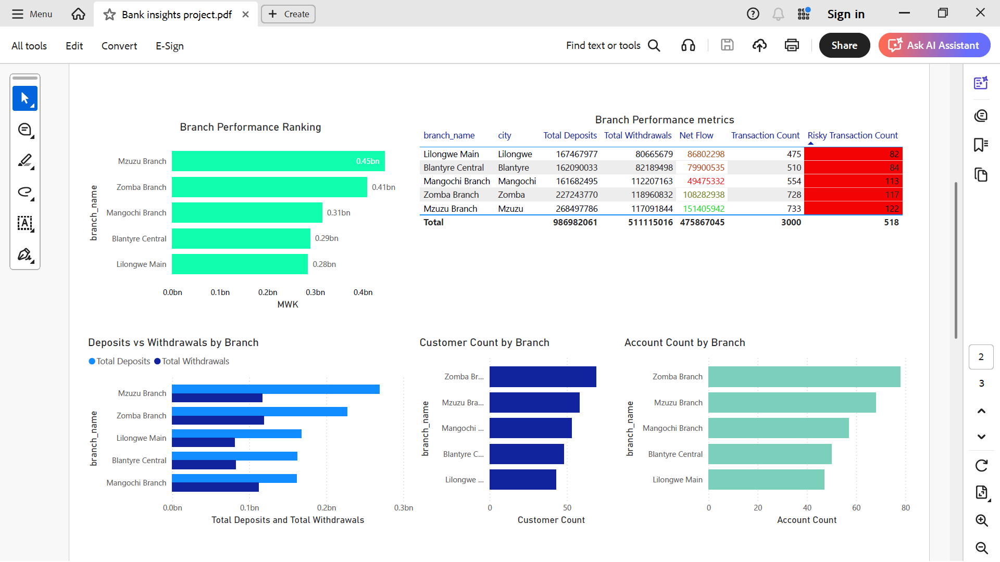
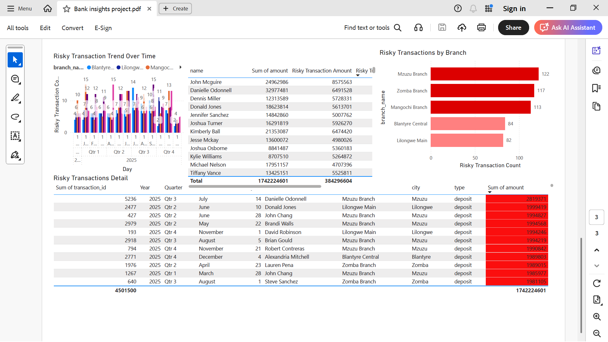

# First Capital Bank Insights BI System

A comprehensive Business Intelligence portfolio project simulating banking operations for **First Capital Bank (FCB)** in Malawi. This end-to-end BI solution demonstrates data generation, ETL processes, dimensional modeling, SQL analytics, and Power BI visualization.

---

## 📋 Project Overview

This project simulates banking operations across **5 branches** in major Malawian cities (Lilongwe, Blantyre, Mzuzu, Zomba, Mangochi) with realistic customer, account, and transaction data. All financial amounts are in **Malawian Kwacha (MWK)**.

**Note**: This is a mock/portfolio project. First Capital Bank is used as a fictional entity for demonstration purposes only.

---

## 🛠️ Tools & Technologies

- **Python 3.8+** - Data generation and ETL
- **pandas** - Data manipulation and cleaning
- **Faker** - Realistic mock data generation
- **SQL** - Star schema data modeling and analytics
- **Power BI** - Interactive dashboards and visualizations

---

## 📁 Project Structure

```
Bank Insights/
│
├── data/
│   ├── raw/              # Raw CSV files (generated)
│   │   ├── customers.csv
│   │   ├── branches.csv
│   │   ├── accounts.csv
│   │   └── transactions.csv
│   │
│   └── clean/             # Cleaned CSV files (after ETL)
│       ├── customers.csv
│       ├── branches.csv
│       ├── accounts.csv
│       └── transactions.csv
│
├── etl/
│   ├── generate_mock_data.py    # Generate mock datasets
│   └── etl_pipeline.py          # ETL pipeline script
│
├── sql/
│   ├── 01_create_star_schema.sql    # Star schema DDL
│   ├── 02_load_data.sql              # Data loading script
│   └── 03_kpi_queries.sql            # Business KPI queries
│
├── powerbi/
│   └── README.md                     # Power BI setup guide
│
├── requirements.txt                  # Python dependencies
└── README.md                         # This file
```

---

## 🚀 Quick Start

### 1. Setup Environment

```bash
# Install Python dependencies
pip install -r requirements.txt
```

### 2. Generate Mock Data

```bash
# Navigate to etl folder
cd etl

# Run data generation script
python generate_mock_data.py
```

This will create:
- **200 customers** across 5 cities
- **5 branches** (one per city)
- **300 accounts** (savings and current)
- **~3,000 transactions** over the past year

### 3. Run ETL Pipeline

```bash
# Still in etl folder
python etl_pipeline.py
```

This will:
- Load raw CSV files
- Clean and standardize data
- Add calculated fields (transaction_month, risk_flag, etc.)
- Save cleaned data to `data/clean/`

### 4. Load Data into Database

**Option A: SQLite (Easiest for Portfolio)**

```bash
# Navigate to sql folder
cd sql

# Run SQLite loader script
python load_to_sqlite.py
```

This creates `data/first_capital_bank.db` which you can use with Power BI or any SQL client.

**Option B: PostgreSQL/MySQL/SQL Server**

1. Set up your SQL database
2. Run SQL scripts in order:
   ```sql
   -- 1. Create star schema
   \i sql/01_create_star_schema.sql
   
   -- 2. Load data (adjust import statements for your DB)
   \i sql/02_load_data.sql
   ```
   
   Note: Adjust the CSV import statements in `02_load_data.sql` based on your database system.

### 5. Create Power BI Dashboards

1. Open Power BI Desktop
2. Import cleaned CSV files from `data/clean/` (or connect to your SQL database)
3. Follow the guide in `powerbi/README.md` to create 3 dashboard pages:
   - **Executive Overview**
   - **Branch Performance**
   - **Risk Monitoring**

---

## 📊 Data Model

### Star Schema Design

The project uses a **star schema** dimensional model optimized for BI analytics:

#### Dimension Tables

- **dim_customer**: Customer demographics (ID, name, gender, age, city, join_date)
- **dim_branch**: Branch information (ID, name, city)
- **dim_account**: Account details (ID, customer_id, branch_id, type, open_date)
- **dim_date**: Date dimension for time-based analysis (date_key, year, quarter, month, week, day_of_week, etc.)

#### Fact Table

- **fact_transactions**: Transaction facts (transaction_id, account_id, date_key, type, amount, risk_flag, etc.)

#### Relationships

```
fact_transactions
    ├──→ dim_account (via account_id)
    ├──→ dim_date (via date_key)
    │
dim_account
    ├──→ dim_customer (via customer_id)
    └──→ dim_branch (via branch_id)
```

---

## 📈 Key Business Insights

### SQL KPI Queries

The `sql/03_kpi_queries.sql` file contains comprehensive analytics queries:

1. **Total Deposits/Withdrawals per Branch**
   - Compare branch performance
   - Calculate net flow (deposits - withdrawals)

2. **Transaction Trends**
   - Daily, weekly, and monthly patterns
   - Identify peak transaction periods

3. **Top 10 Customers by Transaction Volume**
   - Identify high-value customers
   - Analyze customer behavior

4. **Risky Transactions**
   - Flag withdrawals > MWK 500,000
   - Monitor by branch and customer

5. **Branch Performance Ranking**
   - Comprehensive branch metrics
   - Customer count, account count, transaction volume

### Sample Insights (Example Output)

- **Total Deposits**: ~MWK 450,000,000
- **Total Withdrawals**: ~MWK 380,000,000
- **Net Flow**: ~MWK 70,000,000
- **Risky Transactions**: ~15-20 transactions flagged
- **Top Branch**: Lilongwe Main (typically highest volume)
- **Peak Transaction Day**: Friday (highest activity)

---

## 📸 Dashboard Screenshots

*[Add screenshots of your Power BI dashboards here]*

### Executive Overview


### Branch Performance


### Risk Monitoring


---

## 🔍 Data Quality & Cleaning

The ETL pipeline performs the following data quality checks:

- ✅ Standardizes column names (lowercase, underscores)
- ✅ Handles missing values (fills with defaults or medians)
- ✅ Validates data types (dates, numbers)
- ✅ Adds calculated fields:
  - `transaction_month` - For time-based grouping
  - `risk_flag` - Binary flag for withdrawals > MWK 500,000
  - `day_of_week` - For weekly pattern analysis
  - `week` - For weekly aggregations
- ✅ Ensures data consistency (account types, transaction types)

---

## 📝 Key Features

- **Realistic Mock Data**: Uses Faker library for authentic-looking customer names and dates
- **Malawi-Specific**: All branches in major Malawian cities, currency in MWK
- **Production-Ready ETL**: Robust data cleaning and transformation pipeline
- **Star Schema**: Industry-standard dimensional modeling
- **Comprehensive Analytics**: 15+ SQL queries covering various business scenarios
- **Power BI Integration**: Ready-to-use dashboard specifications

---

## 🎯 Business Use Cases

This BI system enables:

1. **Executive Decision Making**: High-level KPIs and trends
2. **Branch Management**: Performance comparison and optimization
3. **Risk Management**: Monitor and flag suspicious transactions
4. **Customer Analytics**: Identify high-value customers and patterns
5. **Operational Insights**: Transaction trends and peak periods

---

## 🔧 Customization

### Adjust Data Volume

Edit `etl/generate_mock_data.py`:
```python
# Change number of records
customers_df = generate_customers(200)  # Change 200 to desired number
accounts_df = generate_accounts(300, 200)  # Adjust as needed
transactions_df = generate_transactions(3000, 300)  # Adjust as needed
```

### Modify Risk Threshold

Edit `etl/etl_pipeline.py`:
```python
# Change risk flag threshold (currently MWK 500,000)
df['risk_flag'] = ((df['type'] == 'withdrawal') & (df['amount'] > 500000)).astype(int)
```

### Add More Branches

Edit `etl/generate_mock_data.py`:
```python
BRANCHES = [
    # Add more branches here
]
```

---

## 📚 SQL Database Compatibility

The SQL scripts are written in **PostgreSQL** syntax but can be easily adapted to:
- **MySQL/MariaDB**: Minor syntax adjustments (e.g., `EXTRACT` → `YEAR()`, `DATE()`)
- **SQL Server**: Use `DATEPART()` instead of `EXTRACT()`
- **SQLite**: Simplified version (no `EXTRACT`, use `strftime()`)

---

## 🐛 Troubleshooting

### Issue: CSV files not found
**Solution**: Ensure you run `generate_mock_data.py` before `etl_pipeline.py`

### Issue: Date parsing errors
**Solution**: Check that date formats in CSV match expected format (YYYY-MM-DD)

### Issue: Foreign key violations
**Solution**: Load dimension tables before fact tables in SQL scripts

### Issue: Power BI relationships not working
**Solution**: Ensure data types match between related columns (e.g., both INT, both DATE)

---

## 📄 License

This is a portfolio project for demonstration purposes. Feel free to use and modify for your own portfolio.

---

## 👤 Author

Created as a BI portfolio project demonstrating end-to-end data pipeline capabilities.

---

## 🔗 Related Resources

- [Power BI Documentation](https://docs.microsoft.com/power-bi/)
- [pandas Documentation](https://pandas.pydata.org/docs/)
- [Faker Documentation](https://faker.readthedocs.io/)

---

## 📊 Project Statistics

- **Lines of Code**: ~1,500+
- **Data Records**: 200 customers, 300 accounts, ~3,000 transactions
- **SQL Queries**: 15+ analytical queries
- **Dashboard Pages**: 3 comprehensive Power BI pages
- **Completion Time**: ~2 hours (as designed)

---

**Last Updated**: December 2024

